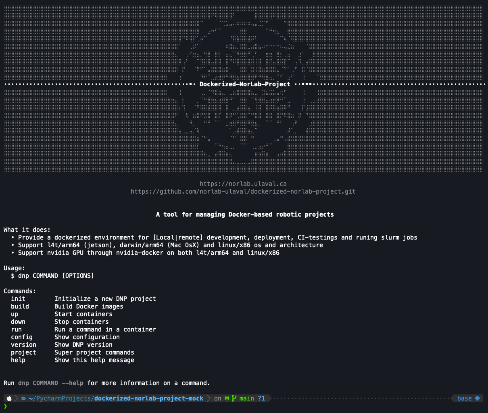

<div align="center">

[//]: # ( ==== Logo ================================================== ) 
<br>
<br>
<a href="https://norlab.ulaval.ca">
    <picture>
      <source media="(prefers-color-scheme: dark)" srcset="/visual/norlab_logo_acronym_light.png">
      <source media="(prefers-color-scheme: light)" srcset="/visual/norlab_logo_acronym_dark.png">
      
    </picture>
</a>
<br>
<br>

[//]: # ( ==== Title ================================================= ) 
[//]: # (TODO: change the title)
# _Dockerized-NorLab-Project (DNP)_

[//]: # ( ==== Hyperlink ============================================= ) 
<sup>
    <a href="http://132.203.26.125:8111">NorLab TeamCity GUI</a>
    (VPN/intranet access) &nbsp; • &nbsp;
    <a href="https://hub.docker.com/repositories/norlabulaval">norlabulaval</a>
    (Docker Hub) &nbsp;
</sup>
<br>
<br>

[//]: # ( ==== Description =========================================== ) 
[//]: # (TODO: Change the description)
**The user side companion of [Dockerized-NorLab(DN)](https://github.com/norlab-ulaval/dockerized-norlab/tree/main).**

It provide a containerized workflow tailor-made for robotic research. <br>
DNP handle the building and instanciation of DN container with functionality for <br> 
development, deployment, testing, continuous integration and release publishing. 

<br>

[//]: # ( ==== Badges ================================================ ) 
[//]: # (Note on shield.io release badge: it works only for public repository)

[](https://github.com/semantic-release/semantic-release)


[//]: # (NorLab teamcity)
[//]: # (TODO: Un-comment the next line if your repository has run configuration enable on the norlab-teamcity-server)
[//]: # (<a href="http://132.203.26.125:8111"></a>)


[//]: # (Dockerhub image badge)
[//]: # (TODO: Un-comment the next line if you have docker images on dockerhub)
[//]: # (TODO: Change "norlabulaval/libpointmatcher" in both url to "your-dockerhub-domain/your-image-name")
[//]: # (<a href="https://hub.docker.com/repository/docker/norlabulaval/libpointmatcher/">  </a>)


<br>

[//]: # ( ==== Maintainer ============================================ ) 
<sub>
Maintainer <a href="https://redleader962.github.io">Luc Coupal</a>
</sub>

<br>
<hr style="color:lightgray;background-color:lightgray">
</div>

[//]: # ( ==== Body ================================================== ) 




### Getting started

```shell
# Clone repository
git clone --recurse-submodule https://github.com/norlab-ulaval/dockerized-norlab-project.git

# Install DNP on host
bash install.bash
# Check install option with $ bash install.bash --help 

# Check available commands
dnp help

# To initialize DNP in a project repository (must be git initialized)
cd <path/to/your/git/project>
dnp init

# To spin a DNP container and open a terminal in it
dnp build
dnp up

# When your done 
dnp down 
```

### For beta tester or just to dry-run DNP in an throwaway project
```shell
# CLone dockerized-norlab-project-mock-EMPTY
git clone https://github.com/norlab-ulaval/dockerized-norlab-project-mock-EMPTY.git
cd dockerized-norlab-project-mock-EMPTY
dnp init
```


