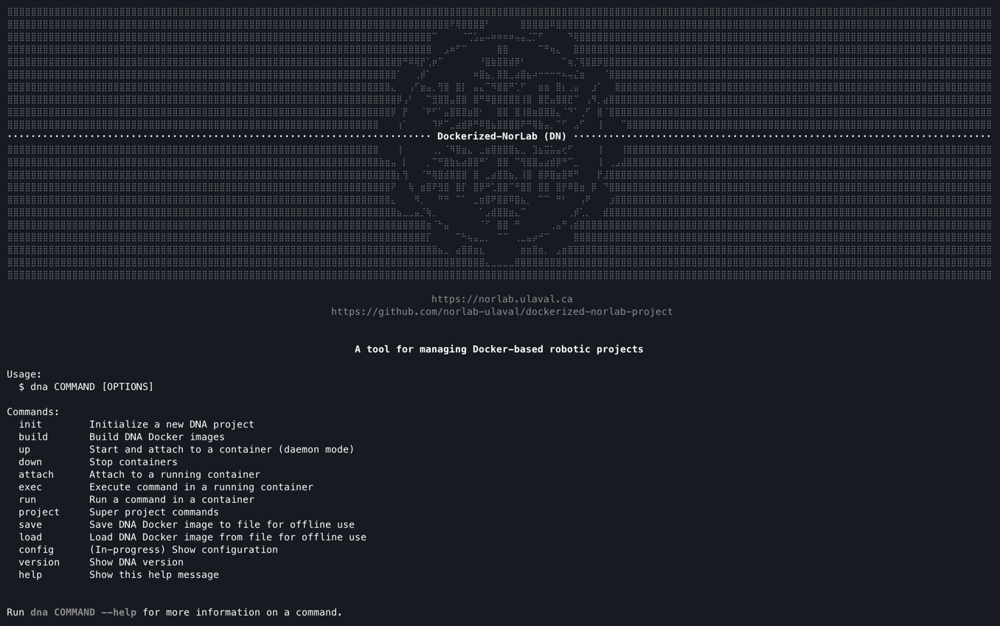

<div align="center">

[//]: # ( ==== Logo ================================================== ) 
<br>
<br>
<a href="https://norlab.ulaval.ca">
    <picture>
      <source media="(prefers-color-scheme: dark)" srcset="/visual/norlab_logo_acronym_light.png">
      <source media="(prefers-color-scheme: light)" srcset="/visual/norlab_logo_acronym_dark.png">
      
    </picture>
</a>
<br>
<br>

[//]: # ( ==== Title ================================================= ) 
# _Dockerized-NorLab project application (DNA)_

[//]: # ( ==== Hyperlink ============================================= ) 
<sup>
    <a href="http://132.203.26.125:8111">NorLab TeamCity GUI</a>
    (VPN/intranet access) &nbsp; • &nbsp;
    <a href="https://hub.docker.com/repositories/norlabulaval">norlabulaval</a>
    (Docker Hub) &nbsp;
</sup>
<br>
<br>

[//]: # ( ==== Description =========================================== ) 
**The user side companion of [Dockerized-NorLab (DN)](https://github.com/norlab-ulaval/dockerized-norlab/tree/main).**

It provide a containerized workflow tailor-made for robotic research. <br>
Dockerized-NorLab project application (DNA) handle the building and instanciation of DN container with functionality for <br> 
development, deployment, testing, continuous integration and release publishing. 

<br>

[//]: # ( ==== Badges ================================================ ) 
[//]: # (Note on shield.io release badge: it works only for public repository)

[](https://github.com/semantic-release/semantic-release)


[//]: # (NorLab teamcity)
[//]: # (TODO: Un-comment the next line if your repository has run configuration enable on the norlab-teamcity-server)
[//]: # (<a href="http://132.203.26.125:8111"></a>)
[//]: # ()

[//]: # (Dockerhub image badge)
[//]: # (TODO: Un-comment the next line if you have docker images on dockerhub)
[//]: # (TODO: Change "norlabulaval/libpointmatcher" in both url to "your-dockerhub-domain/your-image-name")
[//]: # (<a href="https://hub.docker.com/repository/docker/norlabulaval/libpointmatcher/">  </a>)


<br>

[//]: # ( ==== Maintainer ============================================ ) 
<sub>
Maintainer <a href="https://redleader962.github.io">Luc Coupal</a>
</sub>

<br>
<hr style="color:lightgray;background-color:lightgray">
</div>

[//]: # ( ==== Body ================================================== ) 

## What it does:

- Provide a containerized environment for robotic development, deployment, testing, continuous integration, running slurm jobs and source code release.
- Design to support both local and remote workflow, i.e, personal workstation, remote embed computer, server.
- Run on `l4t/arm64` (jetson), `darwin/arm64` (Mac OsX) and `linux/x86` whitout configuration change.
- Support ROS2 out of the box.
- Provide GPU support through nvidia-docker for both `l4t/arm64` and `linux/x86`.
- Project configuration made easy whitout hidding _docker_ and _docker compose_ logic. 

## Getting started

### Install Dockerized-NorLab Project app `dna`

```shell
# Clone repository on host computer
git clone --recurse-submodule https://github.com/norlab-ulaval/dockerized-norlab-project.git
cd dockerized-norlab-project

# Install DNA on host (Check install option with $ bash install.bash --help) 
bash install.bash

# Check available commands
dna 
```



### Make a repository ready to use with DNA

```shell
# To DNA-initialize a project repository (must be git initialized)
cd <path/to/your/project/repository>
dna init
```

Which add a few directories to your project repository
```markup
your-project-repository/
  ├── .dockerized_norlab/     <- DNA configuration
  ├── artifact/                       <- Runtime produced data (mounted)
  ├── external_data/                  <- Pre-existing data made available in your container (mounted)
  ├── src/                            <- Your repository source code (mounted/copied)
  ├── tests/                          <- Your repository test code (mounted/copied)
  ...
  ├── .dockerignore                   <- Specify files/dir that won't be copied in container on build
  ├── .gitignore                      <- Specify files/dir to keep out of VCS
  └── README.md                       <- Created if it did not already exist
```
Note: 
- Any directory or file that already exist will be updated, not overriden.
- Content of the artifact direcotry is persistent. It will remain available even if the container is stoped or removed. 

### Create, run and stop DN container

To spin a DN container and open a terminal in it, run the following command from anywhere in the DNA initialized repository
```shell
dna build develop
dna up

# When your done 
dna down
```

## For beta tester or just to dry-run DNA in an throwaway project
```shell
# CLone dockerized-norlab-project-mock-EMPTY
git clone https://github.com/norlab-ulaval/dockerized-norlab-project-mock-EMPTY.git
cd dockerized-norlab-project-mock-EMPTY
dna init
```


