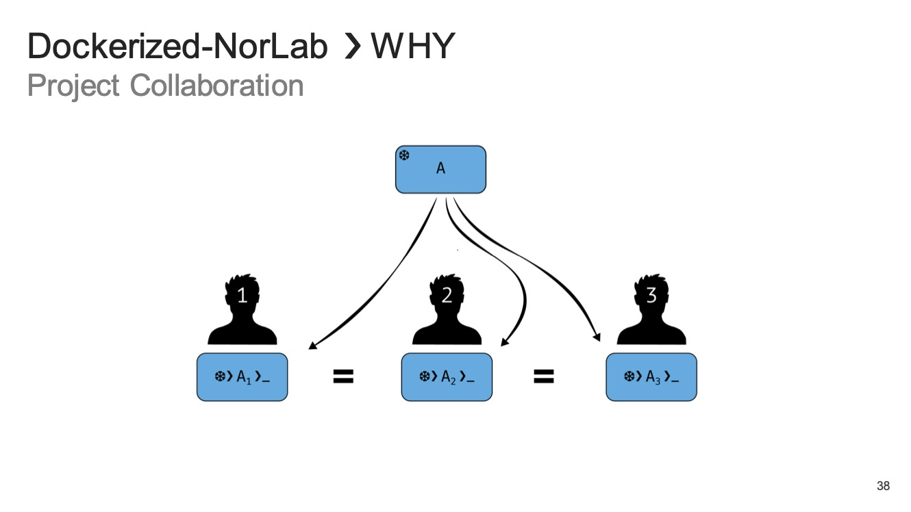

<div align="center">

[//]: # ( ==== Logo ================================================== ) 
<br>
<br>
<a href="https://norlab.ulaval.ca">
    <picture>
      <source media="(prefers-color-scheme: dark)" srcset="/visual/norlab_logo_acronym_light.png">
      <source media="(prefers-color-scheme: light)" srcset="/visual/norlab_logo_acronym_dark.png">
      
    </picture>
</a>
<br>
<br>

[//]: # ( ==== Title ================================================= ) 
# _Dockerized-NorLab project application (DNA)_

[//]: # ( ==== Hyperlink ============================================= ) 
<sup>
    <a href="http://132.203.26.125:8111">NorLab TeamCity GUI</a>
    (VPN/intranet access) &nbsp; • &nbsp;
    <a href="https://hub.docker.com/repositories/norlabulaval">norlabulaval</a>
    (Docker Hub) &nbsp;
</sup>
<br>
<br>

[//]: # ( ==== Description =========================================== ) 
**The user side companion of [Dockerized-NorLab (DN)](https://github.com/norlab-ulaval/dockerized-norlab/tree/main) image builder.**

It provide a containerized workflow tailor-made for robotic research.<br>
Dockerized-NorLab project application (DNA) manage Dockerized-NorLab (DN) container lifecycle<br>
providing functionality for robotic software development, deployment, testing,<br>
continuous integration, slurm job experimentation and release publishing. 

<br>

[//]: # ( ==== Badges ================================================ ) 
[//]: # (Note on shield.io release badge: it works only for public repository)

[](https://github.com/semantic-release/semantic-release)


[//]: # (NorLab teamcity)
[//]: # (TODO: Un-comment the next line if your repository has run configuration enable on the norlab-teamcity-server)
[//]: # (<a href="http://132.203.26.125:8111"></a>)
[//]: # ()

[//]: # (Dockerhub image badge)
[//]: # (TODO: Un-comment the next line if you have docker images on dockerhub)
[//]: # (TODO: Change "norlabulaval/libpointmatcher" in both url to "your-dockerhub-domain/your-image-name")
[//]: # (<a href="https://hub.docker.com/repository/docker/norlabulaval/libpointmatcher/">  </a>)


<br>

[//]: # ( ==== Maintainer ============================================ ) 
<sub>
Maintainer <a href="https://redleader962.github.io">Luc Coupal</a>
</sub>

<br>
<hr style="color:lightgray;background-color:lightgray">
</div>

[//]: # ( ==== Body ================================================== ) 


## What it does

[//]: # (<details open>)
[//]: # (  <summary style="font-weight: bolder;font-size: x-large;">What it does</summary>)

- **Containerized robotic development environment**: Provides a complete containerized workflow for robotic research, development, deployment, testing, continuous integration, running slurm jobs, and source code release.
- **Multi-platform support**: Runs seamlessly on `l4t/arm64` (Jetson), `darwin/arm64` (Mac OS X), and `linux/x86` without configuration changes.
- **Flexible deployment modes**: Supports both local and remote workflows for personal workstations, remote embedded computers, and servers.
- **Robotic Software System ([ROS2](https://github.com/ros2)) ready**: Ready to roll, out of the box.
- **GPU acceleration**: Provides GPU support through [nvidia-docker](https://github.com/NVIDIA/nvidia-docker) for both `l4t/arm64` and `linux/x86` platforms.
- **Transparent configuration**: Makes project configuration easy while keeping [Docker](https://docs.docker.com/) and [Docker Compose](https://docs.docker.com/compose/) logic transparent and accessible.

[//]: # (</details>)

## Why

[//]: # (<details close>)
[//]: # (  <summary style="font-weight: bolder;font-size: x-large;">Why</summary>)

Dockerized-NorLab (DN) and the Dockerized-NorLab project application (DNA) solve critical challenges in robotic research and development by providing a standardized, reproducible, and scalable containerized environment.


<div align="center">
<table>
<tr>
<td></td>
<td></td>
</tr>
<tr>
<td></td>
<td></td>
</tr>
<tr>
<td colspan="2" align="center"></td>
</tr>
</table>
</div>


### Key Benefits

**🔄 Reproducibility**  
Ensure consistent environments across different machines, operating systems, and team members. Your code runs the same way everywhere, eliminating "it works on my machine" problems.

**🔒 Isolation**  
Keep your development environment clean and isolated from your host system. Experiment freely without affecting your main system configuration.

**👥 Project Collaboration**  
Streamline team collaboration with standardized development environments. New team members can get up and running in minutes, not hours or days.

**🚀 Fast Deployment**  
Deploy your robotic applications quickly and reliably across different platforms - from development workstations to production servers and embedded systems.

**✅ Code Quality**  
Maintain high code quality with integrated testing, continuous integration, and standardized development practices built into the containerized workflow.

[//]: # (</details>)

## Use Cases

[//]: # (<details close>)
[//]: # (  <summary style="font-weight: bolder;font-size: x-large;">Use Cases</summary>)

DNA and DN support a wide range of robotic development and deployment scenarios:

<div align="center">
<table>
<tr>
<td></td>
<td></td>
</tr>
<tr>
<td></td>
<td></td>
</tr>
<tr>
<td colspan="2" align="center"></td>
</tr>
</table>
</div>

### Development, Deployment and Release Modes

**🛠 Local and Remote Development (Develop Mode)**  
Set up consistent development environments on local workstations and remote machines. DNA is installed on both local and remote hosts, enabling seamless development workflows across different locations.

**⏯️ Deployment (Deploy Mode)**  
Deploy your robotic applications to target hosts with DNA installed. Streamlined deployment process ensures your applications run consistently in production environments.

**📦 Release Mode**  
Create and distribute source code release. Released containers can run independently without requiring DNA installation on the target system.

### Specialized Workflows

**🔄 Testing and Continuous Integration (CI)**  
Run automated CI tests in isolated, reproducible environments. Perfect for validating code changes and maintaining code quality across your robotic projects. DN/DNA is CI framework agnostic, it can run tests localy or on any CI server.

**🧪 SLURM Job Experiment**  
Execute compute-intensive robotic algorithms and simulations on SLURM-managed clusters with consistent containerized environments.

**◐ Multi-Platform Support**  
Work seamlessly across different operating systems and architectures:
- `l4t/arm64` (NVIDIA Jetson platforms)
- `darwin/arm64` (Mac OS X with Apple Silicon)
- `linux/x86` (Standard Linux systems)

**🎮 GPU Acceleration**  
Leverage GPU computing power for robotics applications through nvidia-docker integration, supporting both ARM64 and x86 platforms.

[//]: # (</details>)

---

## Getting started

[//]: # (<details close>)
[//]: # (  <summary style="font-weight: bolder;font-size: x-large;">Getting started</summary>)

### Install `dna`, the Dockerized-NorLab project app 

```shell
# Clone repository on host computer
git clone --recurse-submodule https://github.com/norlab-ulaval/dockerized-norlab-project.git
cd dockerized-norlab-project

# Install DNA on host (Check install option with $ bash install.bash --help) 
bash install.bash

# Check available commands
dna 
```

### Make a repository ready to use with DNA

```shell
# To DNA-initialize a project repository (must be git initialized)
cd <path/to/your/project/repository>
dna init
```

Which add a few directories to your project repository
```markup
your-project-repository/
  ├── .dockerized_norlab/             <- DNA configuration
  ├── artifact/                       <- Runtime produced data (mounted)
  ├── external_data/                  <- Pre-existing data made available in your container (mounted)
  ├── src/                            <- Your repository source code (mounted/copied)
  ├── tests/                          <- Your repository test code (mounted/copied)
  ...
  ├── .dockerignore                   <- Specify files/dir that won't be copied in container on build
  ├── .gitignore                      <- Specify files/dir to keep out of VCS
  └── README.md                       <- Created if it did not already exist
```
Note: 
- Any directory or file that already exist will be updated, not overriden.
- Content of the artifact direcotry is persistent. It will remain available even if the container is stoped or removed. 

### Create, run and stop DN container

To spin a DN container and open a terminal in it, run the following command from anywhere in the DNA initialized repository
```shell
dna build develop
dna up

# When your done 
dna down
```

> **📖 For detailed configuration and command documentation**, see the [Documentation](#documentation) section below.

[//]: # (</details>)

---

## Documentation

### 📚 Complete Documentation

- **[Command Reference](documentation/dna.md)** - Complete guide to all `dna` commands
  - [dna init](documentation/command/init.md) - Initialize a new DNA project
  - [dna build](documentation/command/build.md) - Build DNA Docker images
  - [dna up](documentation/command/up.md) - Start and attach to containers
  - [dna down](documentation/command/down.md) - Stop containers
  - [dna attach](documentation/command/attach.md) - Attach to running containers
  - [dna exec](documentation/command/exec.md) - Execute commands in containers
  - [dna run](documentation/command/run.md) - Run commands in containers
  - [dna project](documentation/command/project.md) - Super project commands
  - [dna save](documentation/command/save.md) - Save Docker images for offline use
  - [dna load](documentation/command/load.md) - Load Docker images from files
  - [dna config](documentation/command/config.md) - Show configuration
  - [dna version](documentation/command/version.md) - Show DNA version

### ⚙️ Setup & Configuration

- **[Installation Guide](documentation/install.md)** - Detailed installation instructions for all supported platforms
- **[Project Initialization & Configuration](documentation/project_initialization_and_configuration.md)** - Complete guide to setting up and configuring DNA projects
- **[IDE Integration](documentation/ide_integration.md)** - Setup instructions for development environments and IDEs

---

## 🧪 For Beta Testers

To try DNA in a throwaway project:
```shell
# Clone dockerized-norlab-project-mock-EMPTY
git clone https://github.com/norlab-ulaval/dockerized-norlab-project-mock-EMPTY.git
cd dockerized-norlab-project-mock-EMPTY
dna init
```
